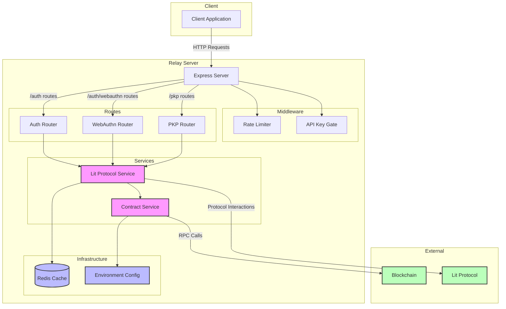

# Lit Protocol Relay Server

A relay server for managing Programmable Key Pairs (PKPs) in the Lit Protocol ecosystem. This server handles PKP minting, authentication, and management operations.

## Architecture



## Features

- PKP (Programmable Key Pair) minting and management
- WebAuthn authentication integration
- Rate limiting and API key validation
- Redis-based caching
- Blockchain contract interactions

## API Documentation

### Authentication Routes (`/auth`)

#### GET `/auth/status/:requestId`
Get the status of a PKP minting request.
- **Parameters**: `requestId` (string)
- **Response**: 
  ```typescript
  {
    status: "InProgress" | "Succeeded" | "Failed"
    error?: string
  }
  ```

### WebAuthn Routes (`/auth/webauthn`)

#### POST `/auth/webauthn/generate-registration-options`
Generate options for WebAuthn registration.
- **Response**: Registration options for WebAuthn authentication

#### POST `/auth/webauthn/verify-registration`
Verify WebAuthn registration and mint a PKP.
- **Body**:
  ```typescript
  {
    credential: RegistrationCredential
  }
  ```
- **Response**:
  ```typescript
  {
    requestId?: string
    error?: string
  }
  ```

### PKP Routes (`/`)

#### POST `/fetch-pkps-by-auth-method`
Fetch PKPs associated with an authentication method.
- **Body**:
  ```typescript
  {
    authMethodType: AuthMethodType
    authMethodId: string
  }
  ```
- **Response**:
  ```typescript
  {
    pkps?: Array<{
      tokenId: string
      publicKey: string
      ethAddress: string
    }>
    error?: string
  }
  ```

## Authentication Methods

The server supports various authentication methods:
- EthWallet (1)
- LitAction (2)
- WebAuthn (3)
- Discord (4)
- Google (5)
- GoogleJwt (6)
- OTP (7)
- StytchOtp (9)

## Setup & Development

1. Install dependencies:
   ```bash
   bun install
   ```

2. Set up environment variables:
   - Copy `.env.example` to `.env`
   - Fill in required environment variables

3. Start development server:
   ```bash
   bun run dev
   ```

4. Build for production:
   ```bash
   bun run build
   ```

5. Start production server:
   ```bash
   bun run start
   ```

## Environment Variables

Required environment variables:
- `REDIS_URL`: Redis connection URL
- `API_KEY`: API key for authentication
- Network configuration (based on environment)
- Contract addresses
- Rate limiting configuration

## Security

The server implements several security measures:
- Rate limiting to prevent abuse
- API key validation for all requests
- WebAuthn security for authentication
- Redis-based request tracking

## Dependencies

Major dependencies:
- Express.js for API server
- Redis for caching and rate limiting
- @lit-protocol packages for Lit Protocol integration
- @simplewebauthn for WebAuthn support
- ethers.js for blockchain interactions

## License

[Add your license information here]
