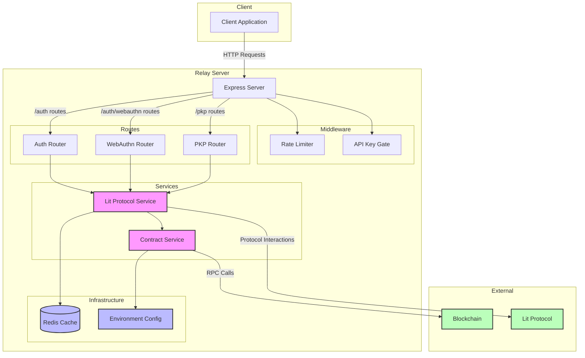

```mermaid
graph TD
    subgraph Client
        client[Client Application]
    end

    subgraph Relay Server
        server[Express Server]
        
        subgraph Middleware
            rate[Rate Limiter]
            apikey[API Key Gate]
        end
        
        subgraph Routes
            auth[Auth Router]
            webauthn[WebAuthn Router]
            pkp[PKP Router]
        end
        
        subgraph Services
            lit[Lit Protocol Service]
            contracts[Contract Service]
        end
        
        subgraph Infrastructure
            redis[(Redis Cache)]
            env[Environment Config]
        end
    end

    subgraph External
        blockchain[Blockchain]
        litprotocol[Lit Protocol]
    end

    %% Client connections
    client -->|HTTP Requests| server
    
    %% Server middleware
    server --> rate
    server --> apikey
    
    %% Route handling
    server -->|/auth routes| auth
    server -->|/auth/webauthn routes| webauthn
    server -->|/pkp routes| pkp
    
    %% Service dependencies
    auth --> lit
    webauthn --> lit
    pkp --> lit
    lit --> contracts
    
    %% Infrastructure connections
    lit --> redis
    contracts --> env
    
    %% External connections
    contracts -->|RPC Calls| blockchain
    lit -->|Protocol Interactions| litprotocol

    %% Styling
    classDef service fill:#f9f,stroke:#333,stroke-width:2px
    classDef infrastructure fill:#bbf,stroke:#333,stroke-width:2px
    classDef external fill:#bfb,stroke:#333,stroke-width:2px
    
    class lit,contracts service
    class redis,env infrastructure
    class blockchain,litprotocol external
```
